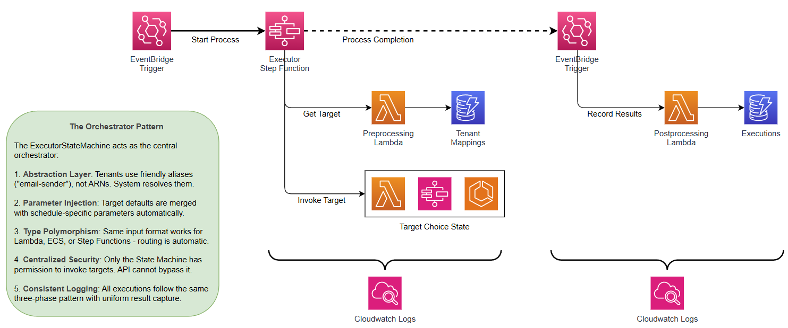

# Part 2: Executor Step Function - Orchestrating Dynamic Execution

---

## Why Step Functions?

The Executor State Machine is the heart of the scheduler. It replaced a monolithic Lambda executor with a visual, orchestrated workflow.

| Capability | Lambda Executor (old) | Step Functions (current) |
|------------|----------------------|-------------------------|
| Visual workflow | No | Yes -- see execution flow as a diagram |
| Error handling | Custom code | Built-in Catch/Retry states |
| Long-running tasks | 15 min max | Hours/days (ECS, nested SFN) |
| Redrive failed executions | Not possible | Restart from failed state |
| Execution history | Custom logging | Automatic per-step history |
| Target type routing | if/else code | Choice state (data-driven) |

---

## The Three-Phase Execution Flow



### Phase 1: Preprocessing

The Preprocessing Lambda resolves tenant intent into a concrete execution plan.

**Input** (from EventBridge or on-demand trigger):
```json
{
  "tenant_id": "acme-corp",
  "target_alias": "send-email",
  "schedule_id": "daily-reminder",
  "payload": { "to": "customer@example.com", "subject": "Your daily reminder" }
}
```

**What it does:**

1. **Resolve tenant mapping** -- Query `TenantMappingsTable` for `tenant_id + target_alias` to get `target_id`
2. **Look up target** -- Query `TargetsTable` for the actual ARN, type, and configuration
3. **Determine target type** -- Parse the ARN to identify Lambda, ECS, or Step Functions
4. **Merge payloads** -- Combine tenant defaults with runtime payload (runtime overrides defaults)
5. **Record IN_PROGRESS** -- Write initial execution record to DynamoDB
6. **Generate CloudWatch URL** -- For Step Functions targets, pre-compute the console URL

**Output** (enriched execution context):
```json
{
  "tenant_id": "acme-corp",
  "target_alias": "send-email",
  "schedule_id": "daily-reminder",
  "target_id": "email-service-v2",
  "target_arn": "arn:aws:lambda:us-east-1:123456789012:function:email-sender-v2",
  "target_type": "lambda",
  "target_config": { "timeout": 30 },
  "merged_payload": {
    "from": "noreply@acme.com",
    "template": "acme-branded",
    "to": "customer@example.com",
    "subject": "Your daily reminder"
  }
}
```

---

### Phase 2: Execution (Dynamic Routing)

The `TargetTypeChoice` state routes to the appropriate executor based on `$.target_type`:

```
                    ┌───────────────────-──────┐
                    │   TargetTypeChoice       │
                    │   (Choice State)         │
                    └─────┬───────┬───────┬────┘
                          │       │       │
              "lambda"    │  "ecs"│       │ "stepfunctions"
                          ▼       ▼       ▼
                    ┌─────────┐ ┌─────┐ ┌──────────────┐
                    │ Lambda  │ │ ECS │ │ Step         │
                    │ Helper  │ │ Run │ │ Functions    │
                    │ Lambda  │ │Task │ │ .sync:2      │
                    └─────────┘ └─────┘ └──────────────┘
```

#### Lambda Targets

Executed via the **Lambda Execution Helper** Lambda:

1. Invokes the target Lambda synchronously
2. Captures the `RequestId` from the response
3. Searches CloudWatch Logs for the exact log stream containing that `RequestId`
4. Generates a **direct console URL** to the log stream
5. Returns the response payload + logs URL

**Why a helper Lambda instead of native integration?** Step Functions' native Lambda integration doesn't expose the `RequestId`, which is needed to find the exact CloudWatch log stream for that invocation.

#### ECS Targets

Executed via **native Step Functions ECS integration** (`ecs:runTask.waitForTaskToken`):

1. Starts an ECS task with `TASK_TOKEN` and `EXECUTION_PAYLOAD` as environment variables
2. Step Functions pauses, waiting for the task to call back
3. ECS container performs work, then calls `SendTaskSuccess` or `SendTaskFailure`
4. Step Functions resumes with the result

**Supports long-running workloads** -- ECS tasks can run for hours without timeout concerns.

#### Step Functions Targets

Executed via **nested synchronous execution** (`states:startExecution.sync:2`):

1. Starts a nested state machine with a predictable name (`{parent-uuid}-nested`)
2. Waits synchronously for the nested execution to complete
3. Returns the execution ARN and output

**The `-nested` naming convention** is critical for the redrive functionality (explained below).

---

### Phase 3: Postprocessing

Postprocessing is **decoupled** from the state machine via EventBridge:

1. Step Functions emits a status change event when execution completes
2. An EventBridge rule matches `SUCCEEDED | FAILED | TIMED_OUT | ABORTED` events scoped to the Executor State Machine
3. The Postprocessing Lambda is triggered automatically
4. It calls `DescribeExecution` to get full details, then writes the execution record to DynamoDB

**Why EventBridge instead of a direct call from the state machine?**

- **Decoupling** -- State machine doesn't know postprocessing exists
- **Reliability** -- EventBridge guarantees at-least-once delivery
- **Error isolation** -- Postprocessing failure doesn't affect execution status
- **Extensibility** -- Add more handlers (notifications, dashboards) without changing the state machine

---

## The Parallel State Pattern for Error Handling

The entire execution phase is wrapped in a `Parallel` state with a **single branch**:

```json
{
  "Type": "Parallel",
  "Branches": [{
    "StartAt": "TargetTypeChoice",
    "States": { "..." }
  }],
  "ResultSelector": {
    "execution_result.$": "$[0].execution_result",
    "tenant_id.$": "$[0].tenant_id"
  },
  "Next": "EventBridgeHandoff"
}
```

**Why this pattern?**

1. **Centralized error handling** -- All errors from any target type bubble up to one place
2. **Consistent output format** -- `ResultSelector` normalizes the output regardless of which target type ran
3. **Redrive capability** -- Failed executions can be redriven from the Parallel state
4. **Error enrichment** -- Adds execution context to error details

Without the Parallel wrapper, errors from different target types would have different formats, making postprocessing and redrive complex.

---

## Target Mapping: The Power of Indirection

The target mapping system is a form of **runtime dependency injection**:

```
Tenant says: "send-email"
    ↓
System asks: "What does this tenant mean by 'send-email'?"
    ↓
Mapping says: "They mean target_id 'email-service-v2'"
    ↓
System asks: "How do I execute 'email-service-v2'?"
    ↓
Target says: "I'm a Lambda at this ARN"
    ↓
Choice state: Routes to ExecuteLambdaTarget
    ↓
Lambda executed with injected configuration
```

**Every step is configurable. Nothing is hardcoded.**

### Real-World Example: Three Tenants, Same Alias

| Tenant | Alias | Target | Type | Execution Path |
|--------|-------|--------|------|----------------|
| ACME Corp | `send-email` | email-lambda-v2 | Lambda | Fast SES send |
| Globex Inc | `send-email` | email-ecs-bulk | ECS | High-volume batch |
| Initech | `send-email` | email-approval-flow | Step Functions | Multi-step approval |

**Same interface. Different implementations. Zero code changes to add or upgrade.**

### Zero-Downtime Upgrades

```
Before:  ACME: send-email → email-v1 (5 seconds)
After:   ACME: send-email → email-v2 (1 second)
```

Update the mapping record in DynamoDB. No code changes. No downtime. Next execution uses the new version.

---

## Redrive: Retrying Failed Executions

When an execution fails, the system captures rich redrive information:

```json
{
  "can_redrive": true,
  "redrive_from_state": "ExecuteTargetWithErrorHandling",
  "failed_state": "ExecuteLambdaTarget",
  "state_machine_execution_arn": "arn:aws:states:...",
  "error": {
    "Error": "Lambda.ServiceException",
    "Cause": "Rate exceeded"
  }
}
```

**Redrive skips already-succeeded states** and retries from the failed state with the same input. This means preprocessing (which succeeded) is not re-run.

### The Step Functions Redrive Challenge

For **Step Functions targets**, a special challenge exists: the child execution uses the `-nested` naming convention (`{parent-uuid}-nested`). When a child is redriven, its EventBridge completion event carries the **child's** state machine ARN, which doesn't match the `ExecutionStatusEventRule` scoped to the Executor State Machine.

**Solution: Redrive Monitor State Machine**

When redrive is triggered for a Step Functions target:

1. The API redrives the child execution
2. A **RedriveMonitorStateMachine** is started alongside
3. The monitor polls the child using `Wait(60s) → DescribeExecution → Choice` loop
4. When the child reaches a terminal state, `RecordRedriveResultLambda` writes the final result to DynamoDB

```
POST /executions/{id}/redrive
    │
    ├── sfn:RedriveExecution(child)
    ├── DynamoDB: status → IN_PROGRESS
    └── sfn:StartExecution(RedriveMonitor)
              │
              ▼
        Wait(60s) → DescribeExecution → Terminal? ──No──► Loop
                                           │
                                          Yes
                                           │
                                           ▼
                                  RecordRedriveResultLambda
                                  (overwrites IN_PROGRESS record)
```

Lambda and ECS redrives go through the standard parent redrive path and are unaffected.

---

## Observability: CloudWatch as the Unified View

Every execution generates a **direct CloudWatch URL** stored in the DynamoDB record:

| Target Type | URL Strategy |
|-------------|-------------|
| **Lambda** | Helper Lambda captures `RequestId`, searches log streams, generates deep link |
| **Step Functions** | Predictable execution ARN → console URL generated during preprocessing |
| **ECS** | Task ARN from result → ECS console deep link |

**End-to-end tracing**: Every execution is assigned a UUIDv7 that flows through all components. A single CloudWatch Insights query across all log groups returns the full chronological story.

---

## DynamoDB Execution Record

```json
{
  "tenant_schedule": "acme-corp#daily-reminder",
  "execution_id": "2026-02-04T10:00:00.000Z#abc-123",
  "tenant_target": "acme-corp#send-email",
  "timestamp": "2026-02-04T10:00:00.000Z",
  "status": "SUCCESS",
  "result": { "message_id": "xyz-789" },
  "cloudwatch_logs_url": "https://console.aws.amazon.com/cloudwatch/...",
  "state_machine_execution_arn": "arn:aws:states:...",
  "redrive_info": null,
  "ttl": 1738761600
}
```

**Query patterns:**
- By schedule: `PK = tenant_id#schedule_id` (sorted by execution_id)
- By target: `GSI tenant_target = tenant_id#target_alias` (sorted by timestamp)
- TTL: Automatic cleanup of old records

---

*Previous: [Part 1 - System Overview](01-overview.md) | Next: [Part 3 - Security Model](03-security-model.md)*
