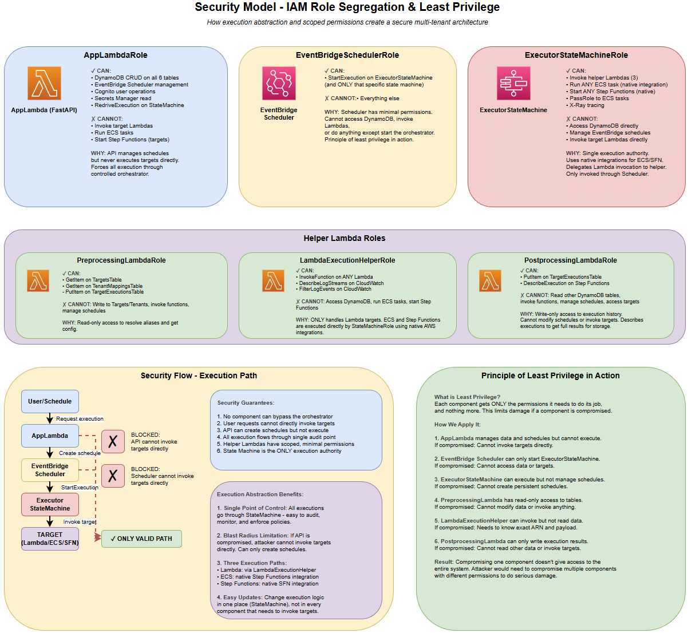

# Part 3: Security Model

---

## Defense in Depth

The Serverless Task Scheduler implements multiple, independent security layers. If one layer is bypassed, others still protect the system.

```
                    ┌─────────────────────────────┐
                    │  Layer 1: Authentication     │
                    │  (Cognito JWT tokens)        │
                    ├─────────────────────────────┤
                    │  Layer 2: Authorization      │
                    │  (Tenant access control)     │
                    ├─────────────────────────────┤
                    │  Layer 3: IAM Roles          │
                    │  (Three-tier permissions)    │
                    ├─────────────────────────────┤
                    │  Layer 4: Data Isolation     │
                    │  (DynamoDB tenant filtering) │
                    ├─────────────────────────────┤
                    │  Layer 5: Audit Trail        │
                    │  (CloudTrail + execution DB) │
                    └─────────────────────────────┘
```

---

## Layer 1: Authentication (Cognito)

Every API request (except health checks and docs) requires a valid JWT token from AWS Cognito.

**Flow:**

1. User logs in via Cognito Hosted UI (email + password)
2. Cognito returns a JWT token containing the user's email
3. Every subsequent API request includes `Authorization: Bearer <JWT>`
4. API Lambda validates the token signature, expiration, and issuer
5. Extracts the user email from the token claims

**What Cognito handles:**
- Password hashing and storage
- Email verification
- Password reset flows
- Token issuance and refresh
- Brute-force protection (lockout after failed attempts)

**No shared passwords.** Each user has their own Cognito account.

---

## Layer 2: Authorization (Tenant Access Control)

After authentication proves _who_ the user is, authorization determines _what_ they can do.

**Flow:**

```
User Request: "Show me schedules for tenant acme-corp"
    │
    ▼
API extracts user email from JWT
    │
    ▼
Query UserMappingsTable: "Which tenants does user@example.com have access to?"
    │
    ▼
Result: ["acme-corp", "globex-inc"]
    │
    ▼
Is "acme-corp" in the list? ──Yes──► Allow request
                              │
                             No
                              │
                              ▼
                         403 Forbidden
```

### Role Hierarchy

| Role | Capabilities |
|------|-------------|
| **Admin** (member of `admin` tenant) | Full access to all tenants. Can create/update/delete target definitions. Can manage user-tenant access. |
| **Tenant Member** | Read/write/execute access within their assigned tenants only. Can create schedules, trigger executions, view history. Cannot manage targets or other tenants. |

**Key principle:** Regular users can only **execute** what admins have pre-approved. They cannot add new Lambda functions or modify target definitions.

---

## Layer 3: Three-Tier IAM Role Model

The system uses **three separate IAM roles** with progressively different permissions. This is the restaurant analogy:

- **API Role** = Waiter: Takes orders, checks if you can pay, but doesn't cook
- **Scheduler Role** = Alarm Clock: Tells the kitchen "it's time" but doesn't place orders
- **Executor Role** = Chef: The only one who actually cooks food

### API Lambda Role (AppLambdaRole)

The most feature-rich role, but critically **cannot invoke target services directly**.

| Permission | Resource | Purpose |
|-----------|----------|---------|
| DynamoDB CRUD | All 6 tables + GSIs | Manage targets, tenants, schedules, users, executions |
| EventBridge Scheduler | Create/Update/Delete schedules | Manage scheduled triggers |
| IAM PassRole | EventBridgeSchedulerRole | Allow EventBridge to assume its role |
| Step Functions | RedriveExecution, DescribeExecution | Redrive failed executions, check status |
| Step Functions | StartExecution (RedriveMonitor only) | Start redrive monitor for SFN targets |
| Cognito | User management operations | Create/delete users, set passwords |
| Secrets Manager | GetSecretValue | Read configuration secrets |
| **Cannot** | Invoke Lambda, Run ECS, Start SFN targets | Security separation |

**Why the API cannot invoke targets directly:** If the API role is compromised, an attacker can manage schedules and data, but cannot execute arbitrary Lambda functions, run containers, or start workflows.

### EventBridge Scheduler Role

The most restricted role in the entire system.

| Permission | Resource | Purpose |
|-----------|----------|---------|
| Step Functions StartExecution | ExecutorStateMachine only | Trigger the executor |
| **Cannot** | Anything else | Absolute minimum permissions |

**Why so restricted:** If this role is compromised, the attacker can only trigger the Executor State Machine -- which has its own validation (preprocessing checks tenant access and target existence).

### Executor State Machine Role

The most privileged role, but only used by the orchestrator.

| Permission | Resource | Purpose |
|-----------|----------|---------|
| Lambda InvokeFunction | Helper Lambdas | Run preprocessing, execution helper, postprocessing |
| ECS RunTask/StopTask | Any ECS task (wildcard) | Execute container targets |
| Step Functions Start/Stop/Describe | Any state machine (wildcard) | Execute nested SFN targets |
| IAM PassRole | ecs-tasks.amazonaws.com | Allow ECS tasks to assume their execution roles |
| X-Ray | Tracing operations | Distributed tracing |
| EventBridge | Rule management | Managed rules for Step Functions |

**Why wildcards for ECS and Step Functions?** New targets are registered dynamically via data. Restricting to specific ARNs would require template updates for every new target.

### Helper Lambda Roles (Least Privilege)

Each helper Lambda gets only the permissions it needs:

| Lambda | Permissions |
|--------|------------|
| **Preprocessing** | DynamoDB `GetItem` on TargetsTable and TenantMappingsTable only |
| **Execution Helper** | Lambda `InvokeFunction` (wildcard), CloudWatch Logs read |
| **Postprocessing** | DynamoDB `PutItem` on ExecutionsTable, Step Functions `DescribeExecution` |

---

## Layer 4: Data Isolation (Multi-Tenancy)

**Every DynamoDB query filters by `tenant_id`.** This is enforced at the application level -- there is no way to construct a query that returns another tenant's data.

### DynamoDB Table Design for Isolation

| Table | Partition Key | Isolation Mechanism |
|-------|--------------|-------------------|
| TargetsTable | `target_id` | Admin-only access (targets are shared resources) |
| TenantsTable | `tenant_id` | Direct tenant isolation |
| TenantMappingsTable | `tenant_id` + SK: `target_alias` | Tenant-scoped queries only |
| SchedulesTable | `tenant_id` + SK: `schedule_id` | Tenant-scoped queries only |
| TargetExecutionsTable | `tenant_id#schedule_id` (composite) | Tenant embedded in partition key |
| UserMappingsTable | `user_id` + SK: `tenant_id` | Maps users to allowed tenants |

**The composite key pattern** (`tenant_id#schedule_id`) ensures that even the primary key lookup requires knowing the tenant. Cross-tenant queries are structurally impossible.

### Access Control Flow

```
1. User authenticates → JWT contains email
2. API queries UserMappingsTable(email) → [tenant_a, tenant_b]
3. User requests data for tenant_c
4. tenant_c NOT in [tenant_a, tenant_b]
5. → 403 Forbidden (before any DynamoDB data query happens)
```

**Admins** (members of the `admin` tenant) can access all tenants for system administration.

---

## Layer 5: Audit Trail

### Execution History (DynamoDB)

Every execution is recorded with:
- Who triggered it (user email or "scheduled")
- When it ran (timestamp)
- What it executed (tenant, target alias, target ARN)
- What the result was (status, response payload, error details)
- Where to find logs (CloudWatch URL)

### CloudTrail

Every AWS API call is logged:
- Who started which Step Functions execution
- Who invoked which Lambda function
- Who read/wrote which DynamoDB records
- Who created/modified which EventBridge schedules

### CloudWatch Logs

All Lambda functions log to CloudWatch with 14-day retention:
- API request/response details
- Preprocessing resolution logic
- Target invocation details
- Postprocessing record writes

---

## Security Architecture Diagram



```
┌──────────────────────────────────────────────────────────┐
│                      USERS                                │
│  ┌──────────┐  ┌──────────┐  ┌──────────┐               │
│  │ Admin    │  │ Tenant A │  │ Tenant B │               │
│  │ User     │  │ User     │  │ User     │               │
│  └────┬─────┘  └────┬─────┘  └────┬─────┘               │
│       │              │              │                     │
│       ▼              ▼              ▼                     │
│  ┌──────────────────────────────────────────┐            │
│  │         Cognito (Authentication)         │            │
│  │         JWT Token Validation             │            │
│  └─────────────────┬────────────────────────┘            │
│                     │                                     │
│                     ▼                                     │
│  ┌──────────────────────────────────────────┐            │
│  │    API Lambda (Authorization)            │            │
│  │    UserMappingsTable → Tenant Access     │            │
│  │    AppLambdaRole (cannot invoke targets) │            │
│  └─────────────────┬────────────────────────┘            │
│                     │                                     │
│                     ▼                                     │
│  ┌──────────────────────────────────────────┐            │
│  │    EventBridge Scheduler                 │            │
│  │    SchedulerRole (can ONLY start SFN)    │            │
│  └─────────────────┬────────────────────────┘            │
│                     │                                     │
│                     ▼                                     │
│  ┌──────────────────────────────────────────┐            │
│  │    Executor State Machine                │            │
│  │    ExecutorRole (broad execution perms)  │            │
│  │    Preprocessing validates tenant access │            │
│  └──────────────────────────────────────────┘            │
│                                                           │
│  ┌──────────────────────────────────────────┐            │
│  │    DynamoDB (Data Isolation)             │            │
│  │    All queries filtered by tenant_id     │            │
│  └──────────────────────────────────────────┘            │
└──────────────────────────────────────────────────────────┘
```

---

## Key Security Design Decisions

### Why can't the API invoke targets directly?

**Separation of concerns.** The API is the management plane; the executor is the data plane. If the API role could invoke arbitrary Lambda functions, a compromised API would have unlimited execution power.

### Why does the Scheduler Role only start Step Functions?

**Blast radius minimization.** EventBridge schedules fire automatically. If the scheduler role had broad permissions, any schedule misconfiguration could trigger unintended actions across the account.

### Why are preprocessing validations inside the executor, not just the API?

**Defense in depth.** Even if someone bypasses the API and starts the executor directly, preprocessing verifies that the tenant mapping exists and the target is valid. This is a second validation layer independent of the API.

### Why no shared IAM credentials for tenants?

**Zero trust.** Users authenticate via Cognito tokens. They never receive AWS IAM credentials. The only roles in the system are service roles assumed by AWS services.

---

*Previous: [Part 2 - Executor Step Function](02-executor-step-function.md) | Next: [Part 4 - API Routes](04-api-routes.md)*
