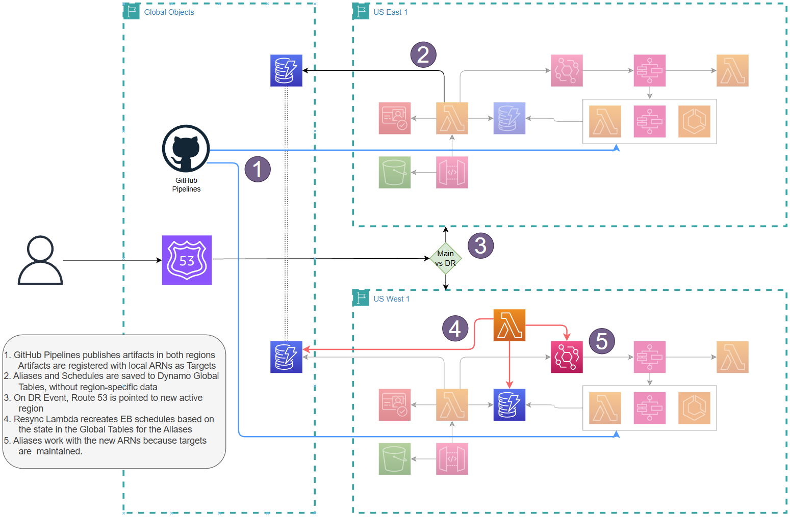

# Part 5: Disaster Recovery Failover Process

---

## DR Architecture Overview

The Serverless Task Scheduler supports **active-passive multi-region DR** using:

- **DynamoDB Global Tables** for automatic data replication
- **DR Resync Lambda** to manage EventBridge schedules during failover
- **Alias-based scheduling** for seamless regional target resolution



---

## Regional Resource Layout

| Resource | Primary (us-east-2) | DR (us-west-2) |
|----------|-------------------|-----------------|
| API Gateway + Lambdas | **Active**, receiving traffic | Deployed, idle |
| DynamoDB Global Tables | Source | Auto-replicated replica |
| DynamoDB Targets table | Regional ARNs (us-east-2) | Regional ARNs (us-west-2) |
| EventBridge Schedules | **Active** | **None until failover** |
| Cognito User Pool | Active | Separate pool (same users) |
| Step Functions | Active | Deployed, idle |

---

## Why Alias-Based Scheduling Enables Seamless Failover

This is the key architectural insight that makes DR work without schedule modification:

```
Schedule stores: target_alias = "send-email"  (NOT an ARN)
                          │
                          ▼
    Preprocessing Lambda resolves at runtime:
        alias → target_id → ARN
                          │
                          ▼
    Uses the LOCAL region's Targets table
                          │
              ┌───────────┴───────────┐
              │                       │
         us-east-2                us-west-2
    arn:aws:lambda:           arn:aws:lambda:
    us-east-2:...:            us-west-2:...:
    email-sender              email-sender
```

**Schedules never contain hard-coded ARNs.** They contain aliases that are resolved at runtime against the local region's Targets table. As long as the DR Targets table has valid us-west-2 ARNs for the same `target_id` values, schedules execute correctly in either region without modification.

---

## The DR Resync Lambda

The DR Resync Lambda is the control mechanism for failover. It operates in three modes:

### `enable` -- Activate DR Region

Reads all schedules from DynamoDB Global Tables (already replicated) and creates corresponding EventBridge schedules in the DR region. Run with `"dry_run": true` first to preview the count before committing.

### `disable` -- Deactivate Region

Deletes all EventBridge schedules in the region to prevent duplicate executions. Always run `disable` on DR **before** re-enabling primary during failback to avoid a window where both regions fire simultaneously.

### `validate` -- Check Consistency

Verifies that every DynamoDB schedule has a corresponding EventBridge schedule and all targets are resolvable. Safe to run at any time, makes no changes. Use this as a pre-failover health check and a post-failover confirmation.

| Response Field | Meaning |
|---------------|---------|
| `status: success` | All schedules have corresponding EventBridge entries and resolvable targets |
| `status: partial` | Some schedules missing -- check `warnings` |
| `summary.missing_targets` | Schedules whose `target_id` is absent from the regional Targets table |
| `summary.missing_mappings` | Schedules with no matching TenantMapping |

---

## Failover and Failback Procedures

> **See the operational runbook: [DISASTER_RECOVERY.md](../DISASTER_RECOVERY.md)**
>
> The runbook contains the exact CLI commands, function name lookups, step-by-step failover and failback sequences, and the teardown warning for orphaned EventBridge schedule groups.

---

## Registering Targets in the DR Region

> **Required before failover.** If the DR Targets table is empty, schedules will fire but all executions will fail because preprocessing cannot resolve targets.

Register each target in both regions using the **same `target_id`** but region-specific ARNs. Use the `/api/targets` endpoint (see [Part 4 - API Routes](04-api-routes.md)) against each region's API URL.

### Why the Targets Table is Regional

The Targets table maps `target_id` to a **region-specific ARN**. It is intentionally **not** a Global Table because:

- Lambda functions, ECS clusters, and Step Functions state machines are regional resources
- The same logical target has different ARNs in different regions
- Your CD pipeline should register targets in each region with the appropriate ARNs

Tenant mappings (which reference `target_id` by alias) **are** stored in a Global Table and replicate automatically.

---

*Previous: [Part 4 - API Routes](04-api-routes.md) | Next: [Part 6 - UI User Guide](06-ui-user-guide.md)*
