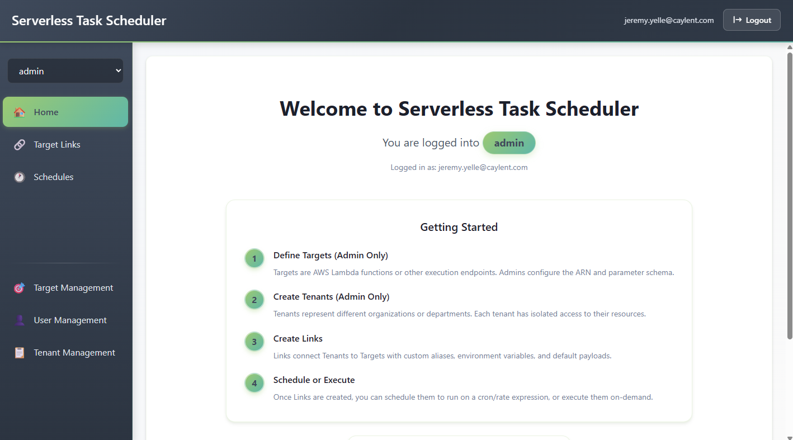
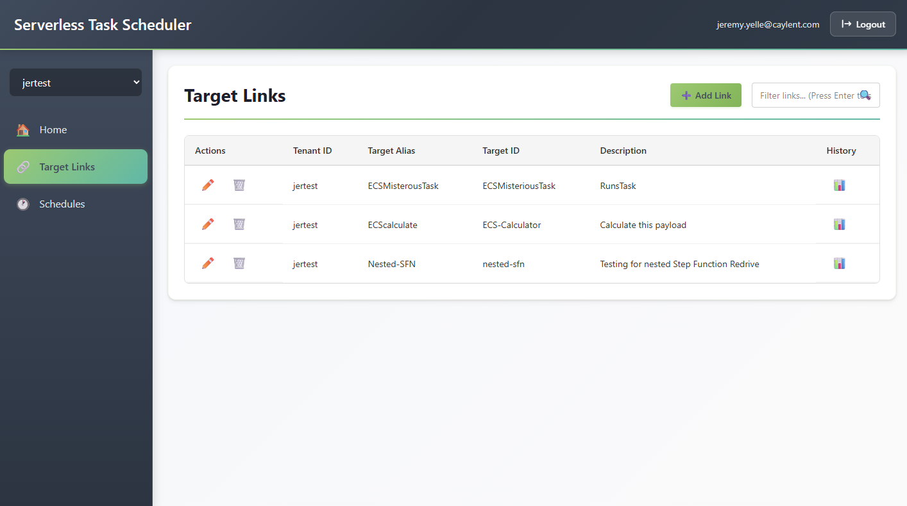
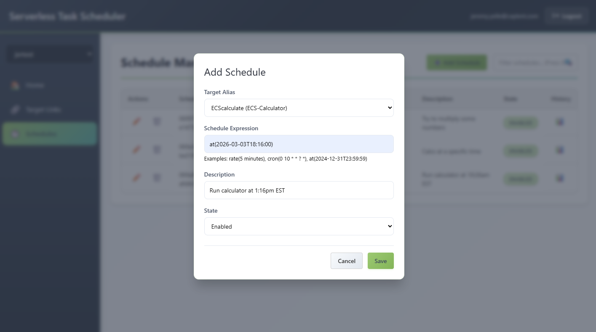
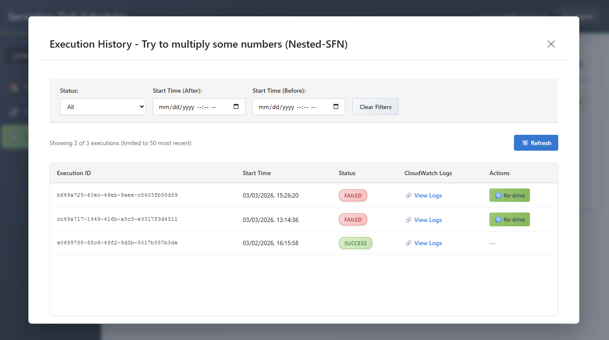

# Part 6: UI User Guide - Target Mapping & Redrive

---

## Overview

The Serverless Task Scheduler provides a React-based web UI for managing all aspects of the scheduler. This guide focuses on the two most important workflows: **target mapping configuration** and **execution redrive**.

The UI is a single-page application (SPA) built with React + Vite, served from S3 via API Gateway.



---

## Getting Started

### First Login

1. Navigate to your API Gateway URL (output from deployment)
2. You'll be redirected to the Cognito Hosted UI login page
3. Enter the email address configured as the `Owner` parameter during deployment
4. Complete the password reset process (first login requires a new password)
5. After authentication, you're redirected back to the application

### Navigation

The UI has a sidebar navigation with the following sections:

| Section | Purpose |
|---------|---------|
| **Tenant Selector** | Switch between tenants you have access to |
| **Target Aliases** | Manage tenant-to-target mappings (aliases) |
| **Schedules** | Create and manage automated schedules |
| **Targets** | Define AWS service targets (admin only) |
| **Users** | User management and tenant access (admin only) |

---

## Target Mapping Management

Target mappings are the core concept of the multi-tenant architecture. A mapping gives a tenant a **friendly alias** for an AWS target, along with optional default payload values.

### Viewing Mappings



Navigate to **Target Aliases** in the sidebar. You'll see a list of all mappings for the currently selected tenant:

- **Alias name** -- The friendly name (e.g., `send-email`, `process-data`)
- **Target ID** -- The underlying target definition it points to
- **Target Type** -- Lambda, ECS, or Step Functions (derived from the target ARN)
- **Default Payload** -- Pre-configured parameters merged into every execution

### Creating a Mapping

1. Click **"Add Mapping"** (or the + button)
2. Fill in the mapping form:

| Field | Description | Example |
|-------|-------------|---------|
| **Target Alias** | Friendly name for this tenant | `daily-report` |
| **Target ID** | Select from available targets (dropdown) | `report-generator-v2` |
| **Default Payload** | JSON object merged with every execution (optional) | `{"format": "pdf", "recipients": ["team@acme.com"]}` |

3. Click **Save**

**Key concept:** The default payload is merged with the runtime payload at execution time. Runtime values override defaults:

```
Default:  { "format": "pdf", "recipients": ["team@acme.com"] }
Runtime:  { "subject": "Q4 Report", "recipients": ["ceo@acme.com"] }
Merged:   { "format": "pdf", "subject": "Q4 Report", "recipients": ["ceo@acme.com"] }
```

### Editing a Mapping

Click the mapping row to expand its details, then:

- **Change target** -- Point the alias to a different target (e.g., upgrade from v1 to v2)
- **Update default payload** -- Modify the baseline configuration
- **View execution history** -- See recent executions for this mapping

**Zero-downtime upgrade example:** Change `daily-report` from `report-generator-v1` to `report-generator-v2`. Next execution automatically uses the new version. No schedule changes needed.

### Deleting a Mapping

Click the delete button on the mapping row. This will:
- Remove the alias mapping from DynamoDB
- **Does NOT delete** associated schedules (they will fail on next run since the alias no longer resolves)

> **Best practice:** Delete or update schedules before deleting a mapping.

---

## One-Time Execution via Schedule

There is no separate "run now" button in the UI. To trigger a target once at a specific time, create a schedule using the `at()` expression. EventBridge will fire the schedule exactly once at the specified time and the schedule can be deleted afterward.

### Creating a One-Time Schedule

From the **Schedules** section:

1. Click **"Add Schedule"**
2. Set the **Schedule Expression** to an `at()` expression: `at(YYYY-MM-DDTHH:MM:SS)`
3. Fill in the remaining fields (Target Alias, optional Target Input, etc.)
4. Click **Save**



**Example:** To run the `daily-report` mapping on March 20, 2026 at 2:30 PM UTC:

```
at(2026-03-20T14:30:00)
```

The execution goes through the same Step Functions orchestration as any recurring scheduled run, ensuring consistent security, logging, and result recording. After it fires, you can delete the schedule or leave it — it will not fire again.

### Viewing Execution History

Click **"Execution History"** on any mapping to open the history modal:



Each execution shows:

| Field | Description |
|-------|-------------|
| **Execution ID** | Unique identifier (timestamp-based, sortable) |
| **Status** | `SUCCESS`, `FAILED`, `IN_PROGRESS` |
| **Timestamp** | When the execution started |
| **Result** | Response payload (expandable JSON) |
| **CloudWatch Logs** | Direct link to the exact log stream or Step Functions execution |
| **Redrive Info** | For failed executions: which state failed, can it be redriven |

Executions are sorted newest-first. Use the scroll or pagination to browse history.

> **Note on the View Logs link:** Clicking it opens the AWS Console directly to the relevant Step Functions execution or CloudWatch log stream. This requires that you are already authenticated in the AWS Console and logged in to the correct account and region — otherwise AWS will redirect you to the login page or show an access error.

---

## Redrive: Retrying Failed Executions

Redrive is the ability to **restart a failed execution from the point of failure** without re-running the steps that already succeeded.

### When to Use Redrive

- A Lambda target failed due to a transient error (rate limit, timeout)
- An ECS task failed due to a temporary infrastructure issue
- A Step Functions target failed in a specific step that has been fixed
- You've corrected the target configuration and want to re-try

### How to Redrive

1. Open **Execution History** for the mapping
2. Find the failed execution (status: `FAILED`)
3. Check the **Redrive Info** section:
   - `can_redrive: true` -- Redrive is available
   - `failed_state` -- Which state in the Step Functions workflow failed
   - `redrive_from_state` -- Where the redrive will restart from


4. Click the **"Redrive"** button
5. Confirm the action

### What Happens During Redrive

```
User clicks "Redrive"
    │
    ▼
API: POST /tenants/{tid}/mappings/{alias}/executions/{eid}/redrive
    │
    ├── Step Functions: RedriveExecution (restarts from failed state)
    ├── DynamoDB: Update status → IN_PROGRESS
    │
    ├── For Lambda/ECS targets:
    │   └── Standard parent redrive path
    │       (EventBridge detects completion → Postprocessing records result)
    │
    └── For Step Functions targets:
        └── RedriveMonitorStateMachine started
            (Polls child execution → RecordRedriveResultLambda writes result)
```

### Redrive for Step Functions Targets -- Special Handling

When the target is a Step Functions workflow, a special **Redrive Monitor** is needed:

**The problem:** The child execution uses the `-nested` naming convention. When redriven, its completion event carries the child's state machine ARN, which doesn't match the main EventBridge rule (scoped to the Executor State Machine only).

**The solution:** A `RedriveMonitorStateMachine` is started alongside the redrive:

1. Polls the child execution every 60 seconds using `DescribeExecution`
2. When the child reaches a terminal state, invokes `RecordRedriveResultLambda`
3. The Lambda derives the parent execution ID by stripping `-nested` from the child name
4. Overwrites the `IN_PROGRESS` DynamoDB record with the final status

### After Redrive

- The execution record updates from `IN_PROGRESS` to `SUCCESS` or `FAILED`
- If it fails again, a new `redrive_info` is generated and redrive can be attempted again
- The execution history shows the updated result and timestamp

---

## Schedule Management

### Creating a Schedule

From the **Schedules** section or from a mapping's detail view:

1. Click **"Add Schedule"**
2. Fill in the schedule form:

| Field | Description | Example |
|-------|-------------|---------|
| **Schedule ID** | Unique name for this schedule | `daily-9am-report` |
| **Target Alias** | Which mapping to execute | `daily-report` |
| **Schedule Expression** | Cron, rate, or one-time | `cron(0 9 * * ? *)` |
| **Timezone** | IANA timezone for cron expressions | `America/New_York` |
| **State** | ENABLED or DISABLED | `ENABLED` |
| **Target Input** | Runtime payload for this schedule (JSON) | `{"region": "northeast"}` |
| **Description** | Human-readable description | `Daily report at 9 AM ET` |

### Schedule Expression Examples

| Expression | Meaning |
|-----------|---------|
| `cron(0 9 * * ? *)` | Every day at 9:00 AM |
| `cron(0 12 ? * MON-FRI *)` | Weekdays at noon |
| `cron(0 0 1 * ? *)` | First of every month at midnight |
| `rate(5 minutes)` | Every 5 minutes |
| `rate(1 hour)` | Every hour |
| `at(2026-12-31T23:59:59)` | One-time execution |

### Editing a Schedule

Click the schedule row to expand, then modify:
- **Expression** -- Change the timing
- **State** -- Enable/disable without deleting
- **Target Input** -- Update the payload
- **Timezone** -- Change the timezone

### Viewing Schedule Executions

Each schedule has its own execution history showing all past runs. Click **"Execution History"** on the schedule row.

---

## User Management (Admin)

### Inviting Users

1. Navigate to **Users** in the sidebar
2. Click **"Invite User"**
3. Enter the user's email address
4. Select which tenants to grant access to
5. Click **"Invite"**

The user receives a Cognito email with a temporary password. On first login, they set a new password.

### Managing Tenant Access

- **Grant access:** Select a user, click "Add Tenant", choose the tenant
- **Revoke access:** Click the X next to a tenant in the user's access list
- **Bulk update:** Edit a user to set their complete tenant list at once

### Admin vs Regular Users

| Capability | Admin | Regular User |
|-----------|-------|-------------|
| View targets | Yes | No |
| Create/edit targets | Yes | No |
| Create/edit tenants | Yes | No |
| Invite users | Yes | No |
| Manage user access | Yes | No |
| View mappings (own tenants) | Yes | Yes |
| Create/edit mappings | Yes | Yes |
| Create/edit schedules | Yes | Yes |
| Create one-time schedules | Yes | Yes |
| View execution history | Yes | Yes |
| Redrive failed executions | Yes | Yes |

---

## Troubleshooting

### Execution Shows "FAILED"

1. Check the **Result** field for error details
2. Click the **CloudWatch Logs URL** for full execution logs
3. Check the **failed_state** to identify where in the pipeline it failed:
   - `Preprocessing` -- Target alias not found, or target doesn't exist
   - `ExecuteLambdaTarget` -- Lambda function error
   - `ExecuteECSTarget` -- ECS task failure
   - `ExecuteStepFunctionTarget` -- Nested workflow failure
4. Fix the issue, then **Redrive** the execution

### Execution Stuck at "IN_PROGRESS"

This can happen if:
- The target is still running (especially ECS tasks that run for hours)
- The Postprocessing Lambda failed to record the result
- For redriven Step Functions targets: the RedriveMonitor failed to start

**For stuck records:** Wait for the target to complete, or check Step Functions console for the execution status.

### "403 Forbidden" Errors

- Your user doesn't have access to the requested tenant
- Contact an admin to grant you access via the Users management page
- If you're an admin, check that the `admin` tenant mapping exists in your UserMappingsTable

### Schedule Not Firing

1. Check the schedule **State** is `ENABLED`
2. Verify the **schedule expression** is valid
3. Check EventBridge Scheduler in the AWS Console for the schedule status
4. Run the DR Resync `validate` mode to check for consistency issues

---

*Previous: [Part 5 - DR Failover Process](05-dr-failover.md) | Back to: [Table of Contents](00-table-of-contents.md)*
