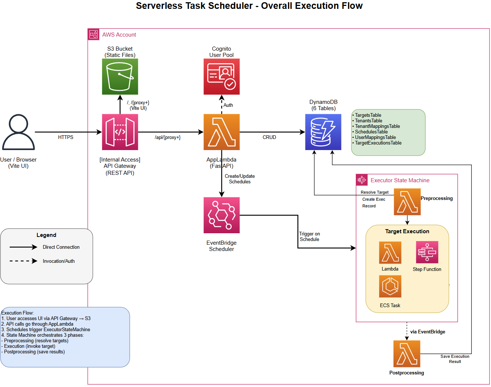

# Serverless Task Scheduler

A multi-tenant AWS platform that lets organizations schedule and run cloud services -- without managing servers, and without depending on engineering teams for day-to-day changes.

## Why This Exists

In most organizations, setting up a scheduled task on AWS requires an engineer to write code, configure infrastructure, and deploy it. If a business team needs to change when something runs, or point it at a new version of a service, they file a ticket and wait.

The Serverless Task Scheduler removes that bottleneck. **Tenant account managers can create schedules, update target mappings, trigger executions, and view results through a web UI** -- no infrastructure knowledge required. Engineering defines _what_ can be run (targets). Business teams control _when_ and _how_ it runs (schedules and mappings).

### Business Value

- **Self-service operations** -- Account managers update schedules and mappings without engineering tickets or deployments. A schedule change that used to require a code review and deploy cycle now takes 30 seconds in the UI.
- **Zero-downtime upgrades** -- Point a tenant to a new version by changing a mapping record, not by redeploying code. The next execution automatically picks up the change.
- **Multi-tenant isolation** -- Multiple organizations share one platform safely. Each tenant sees only their own schedules, mappings, and execution history. The database enforces this at the query level.
- **Full audit trail** -- Every execution is recorded with its status, result payload, and a direct link to the CloudWatch logs. If something fails, you know exactly what happened and where.
- **No idle costs** -- The entire platform is serverless. There are no EC2 instances running when nothing is happening. You pay only when tasks actually execute.

---

## How It Works (The Big Picture)

The scheduler has three parts: a **web UI** where users manage everything, an **API** that handles security and stores configuration, and an **execution engine** that runs the actual tasks.



**Here's what happens when a scheduled task runs:**

1. A user logs into the web UI and creates a schedule: _"Run my daily-report every morning at 9 AM Eastern"_
2. The API validates the user's permissions, saves the schedule to DynamoDB, and creates an EventBridge rule that fires at 9 AM
3. At 9 AM, EventBridge triggers the Executor -- a Step Functions state machine that orchestrates the entire execution
4. The Executor first looks up what "daily-report" actually means for this tenant (which real AWS service to call, what default configuration to use), then runs it
5. When the target finishes, a Postprocessing Lambda records the result -- success or failure, the response payload, and a direct link to the CloudWatch logs
6. The user checks the UI and sees the outcome. If it failed, they can click a link to see the exact logs, and optionally _redrive_ (retry) the execution from the point of failure

This same flow works whether the task was triggered by a schedule or by a user clicking "Execute Now" in the UI. Every execution goes through the same security checks, orchestration, and result recording.

---

## Core Concepts

There are four things you need to understand to work with this system. Everything else builds on these.

### Targets

A **target** is an AWS service that can be executed. Think of it as a tool in a toolbox -- you define it once, and then multiple tenants can use it.

Three types of targets are supported:

- **Lambda functions** -- For quick tasks that finish in under 15 minutes (sending an email, generating a report, processing a file)
- **ECS containers** -- For longer-running workloads that need more compute time (batch data processing, ML model training, video encoding)
- **Step Functions workflows** -- For multi-step processes where each step depends on the previous one (approval workflows, ETL pipelines)

Each target definition includes the AWS resource ARN (the address of the service), its type, and optionally a parameter schema that describes what inputs it accepts.

_Only platform admins can create or modify targets._ This is intentional -- it means the engineering team controls which services are available, while tenant users control how and when they're used.

### Tenants

A **tenant** represents an organization, team, or customer. Each tenant is completely isolated from every other tenant -- they can't see each other's schedules, mappings, or execution history.

Think of tenants as separate apartments in the same building. Everyone shares the same infrastructure (the building), but each apartment is private. The database enforces this isolation at the query level: every query includes a tenant filter, so it's structurally impossible to accidentally return another tenant's data.

### Mappings (Target Aliases)

A **mapping** gives a tenant a friendly name (alias) for a target. This is the most important concept in the system, because it's what makes self-service possible.

Instead of asking a tenant to know that their email service lives at `arn:aws:lambda:us-east-1:123456789012:function:email-sender-v2`, you give them an alias like `send-email`. The mapping connects the alias to the real target, and it can also include default configuration values (like a sender address or template name) that get merged into every execution.

Different tenants can use the same alias but have it point to completely different targets:

```
ACME Corp:   "send-email"  →  email-sender-v2      (Lambda, fast SES-based sender)
Globex Inc:  "send-email"  →  email-bulk-processor  (ECS container, high-volume batch)
Initech:     "send-email"  →  email-approval-flow   (Step Functions, requires manager approval)
```

Same alias. Different implementations. The tenants don't know or care about the difference.

### Schedules

A **schedule** is a timer that automatically runs a mapping at specified times. Under the hood, it creates an AWS EventBridge Scheduler rule.

Schedules support standard cron expressions, simple rates, and one-time executions:

- `cron(0 9 * * ? *)` -- Every day at 9:00 AM
- `cron(0 12 ? * MON-FRI *)` -- Weekdays at noon
- `rate(5 minutes)` -- Every 5 minutes
- `at(2026-12-31T23:59:59)` -- One-time execution at a specific time

Schedules also support timezones, so `cron(0 9 * * ? *)` with timezone `America/New_York` fires at 9 AM Eastern, not UTC.

### Why Mappings Matter for Self-Service

Mappings are the layer of indirection that separates "what the business wants to do" from "how the infrastructure does it." This separation is what lets account managers operate independently:

- **Change when something runs** -- Edit the schedule expression in the UI. No engineering involvement.
- **Change the default configuration** -- Edit the mapping's default payload (e.g., change the report format from CSV to PDF). No engineering involvement.
- **Upgrade the underlying service** -- Engineering updates the mapping to point to a new target version. No schedule changes needed, no downtime, no coordination with the tenant.

```
Tenant "ACME Corp" has alias "send-email"
    → currently points to email-sender-v1 (Lambda)
    → engineering updates the mapping to email-sender-v2
    → next execution automatically uses v2
    → ACME Corp didn't change anything; their schedules keep working
```

This is the core value proposition: **business teams manage their own schedules and configurations, engineering manages the underlying infrastructure, and neither blocks the other.**

---

## The Execution Engine

The execution engine is the part of the system that actually runs your tasks. It's built as an AWS Step Functions state machine, which means it's a visual, step-by-step workflow that you can inspect in the AWS Console.

When a schedule fires (or a user clicks "Execute Now"), the Executor handles the work in three phases:

1. **Preprocessing** -- A Lambda function looks up the tenant's mapping in DynamoDB, finds the actual target (the real AWS ARN), and merges the schedule's runtime payload with the mapping's default values. For example, if the mapping defaults include `"from": "noreply@acme.com"` and the schedule provides `"to": "customer@example.com"`, the final payload includes both.

2. **Execution** -- The state machine routes to the appropriate executor based on the target type. Lambda targets are invoked through a helper Lambda that captures the CloudWatch log stream URL. ECS targets are started as Fargate tasks that call back when complete. Step Functions targets are run as nested executions. A `Choice` state in the workflow handles this routing -- no if/else code needed.

3. **Postprocessing** -- When the execution finishes (success or failure), an EventBridge rule automatically triggers a Postprocessing Lambda. This Lambda records the result to DynamoDB, including the status, response payload, error details (if any), and a direct link to the CloudWatch logs for that specific execution.

### Redrive (Retrying Failed Executions)

If an execution fails, the system captures exactly _which step_ failed and whether it can be retried. Users can **redrive** (retry) the execution from the point of failure -- the steps that already succeeded are skipped. This is especially useful when a failure was caused by a temporary issue like a rate limit or a network timeout.

For Step Functions targets, redrive uses a dedicated monitor state machine that polls the redriven child execution and records the final result back to DynamoDB when it completes.

> **Deep dive:** [Executor Step Function](.docs/02-executor-step-function.md) covers the three-phase flow in detail, including the Choice state routing pattern, the Parallel state error handling wrapper, CloudWatch log URL generation for each target type, and the full redrive monitor design.

---

## Security

The system uses multiple independent layers of security. If one layer is somehow bypassed, the others still protect the system. This is called "defense in depth."

**Authentication** -- Users log in with an email address and password through AWS Cognito (Amazon's managed authentication service). After login, the browser receives a JWT token -- a signed, time-limited credential that proves who the user is. Every API request must include this token. If it's missing, expired, or tampered with, the request is rejected.

**Authorization** -- After verifying _who_ the user is, the API checks _what they're allowed to do_. It queries the UserMappings table to find which tenants the user has access to. If a user tries to access a tenant they're not assigned to, the API returns a 403 Forbidden error -- the request never reaches the database.

**IAM role separation** -- The system uses three separate AWS IAM roles with different permissions, following the principle of least privilege:

- The **API role** can manage schedules and read/write data, but it _cannot_ invoke target services directly
- The **Scheduler role** can _only_ start the Executor state machine -- nothing else
- The **Executor role** is the only one that can actually invoke Lambda functions, run ECS tasks, or start Step Functions workflows

This means if the API were compromised, an attacker could modify data but couldn't execute arbitrary services. If the scheduler role were compromised, an attacker could only trigger the Executor, which has its own validation layer.

**Data isolation** -- Every DynamoDB query includes a tenant ID filter. The database table design uses tenant ID as part of the primary key, so it's structurally impossible to write a query that returns another tenant's data.

> **Deep dive:** [Security Model](.docs/03-security-model.md) details all five security layers, the full IAM permission matrix for each role, the DynamoDB table key design for tenant isolation, and the admin privilege model.

---

## API

The API is the interface between the web UI (or any HTTP client) and the platform's data and services. It's built with FastAPI (a modern Python web framework) and runs on AWS Lambda behind API Gateway.

After deployment, interactive API documentation is available at `/swagger` -- you can browse every endpoint, see request/response schemas, and test calls directly from the browser.

The API is organized into these groups:

| Group | What it does | Who can use it |
|-------|-------------|----------------|
| `/auth/*` | Login, logout, password reset, account confirmation | Everyone (no token needed) |
| `/targets/*` | Define which AWS services can be executed | Admins only |
| `/tenants/*` | Create and manage organizations | Admins only |
| `/tenants/{id}/mappings/*` | Create target aliases, set default payloads, trigger executions | Tenant members |
| `/tenants/{id}/.../schedules/*` | Create, update, enable/disable automated schedules | Tenant members |
| `/tenants/{id}/.../executions/*` | View execution history, inspect results, redrive failures | Tenant members |
| `/user/*` | Invite users, grant/revoke tenant access, manage accounts | Admins only |

The API Gateway also serves the React web UI. Requests to `/api/*` go to the FastAPI Lambda, while all other requests serve static files (HTML, CSS, JavaScript) from an S3 bucket. This means a single URL hosts both the API and the UI.

> **Deep dive:** [API Routes](.docs/04-api-routes.md) documents all 54 endpoints with their methods, paths, request/response examples, and authorization requirements.

---

## Disaster Recovery

The system supports **active-passive multi-region disaster recovery**. This means a second copy of the platform is deployed in a different AWS region and sits idle until it's needed. If the primary region goes down, traffic is switched to the DR region.

The key architectural insight that makes this work is **alias-based scheduling**. Schedules store a target alias (like `send-email`), not a hard-coded AWS resource ARN. When a schedule fires, the Preprocessing Lambda resolves the alias to a real ARN using the _local region's_ Targets table. This means:

- The same schedules work in either region without modification
- Each region has its own Targets table with region-appropriate ARNs (a Lambda function in us-east-2 has a different ARN than the same function deployed in us-west-2)
- DynamoDB Global Tables automatically replicate schedule data, tenant data, and mappings to the DR region
- A **DR Resync Lambda** manages EventBridge schedules during failover -- it can create them in the DR region (`enable`), remove them (`disable`), or check that everything is consistent (`validate`)

Schedules are only active in one region at a time to prevent duplicate executions. The failover process is: enable schedules in DR, route traffic to DR. The failback process is: disable schedules in DR, route traffic back to primary.

> **Deep dive:** [DR Failover Process](.docs/05-dr-failover.md) walks through the full failover and failback procedures with copy-paste commands. The [DR Runbook](DISASTER_RECOVERY.md) provides the operational checklist.

---

## Web UI

The web UI is a React single-page application that provides a browser-based interface for all platform operations. It's built with Vite (a fast build tool) and served from S3 through API Gateway.

The UI lets tenant members:

- **View and manage target mappings** -- See which aliases are available, what targets they point to, and what default configuration they include. Create new mappings or update existing ones.
- **Create and manage schedules** -- Set up cron-based or rate-based schedules with timezone support. Enable or disable schedules without deleting them.
- **Execute targets on demand** -- Click "Execute" on any mapping, optionally provide a runtime payload, and trigger an immediate execution.
- **Browse execution history** -- See every past execution with its status (success/failure), result payload, timestamp, and a clickable link to the CloudWatch logs.
- **Redrive failed executions** -- For any failed execution, see which step failed, and retry it from that point.

Admins additionally have access to:

- **Target management** -- Define new Lambda, ECS, or Step Functions targets with their ARNs and parameter schemas.
- **Tenant management** -- Create tenants and configure their properties.
- **User management** -- Invite new users, assign them to tenants, and revoke access.

> **Deep dive:** [UI User Guide](.docs/06-ui-user-guide.md) provides a hands-on walkthrough of target mapping configuration, on-demand execution, schedule management, and the redrive workflow with annotated screenshots.

---

## Quick Start

### Prerequisites

- AWS Account with CLI configured (`aws configure`)
- AWS SAM CLI installed
- Python 3.13+
- Node.js 18+ (for building the UI)
- **Windows users:** WSL2 or Docker (required for building Python cryptography packages)

### Deploy

```bash
./quickdeploy.sh
```

This single command:
1. Builds the React UI (`npm run build`)
2. Validates the SAM template (`sam validate --lint`)
3. Builds the Lambda packages (`sam build`)
4. Deploys all infrastructure to AWS (`sam deploy`)
5. Uploads the UI static files to S3
6. Configures Cognito authentication URLs

### First Login

1. Navigate to the API Gateway URL shown after deployment
2. Log in with the email from the `Owner` parameter (check your inbox for a temporary password from Cognito)
3. Set a new password when prompted
4. You're now an admin -- start by creating tenants, defining targets, and inviting users

### Multi-Environment Deployment

You can deploy separate environments (dev, staging, prod) by defining a named profile for each in `samconfig.toml`:

```toml
[dev.deploy.parameters]
stack_name = "my-scheduler-dev"
parameter_overrides = "Environment=dev Owner=admin@example.com"

[prod.deploy.parameters]
stack_name = "my-scheduler-prod"
parameter_overrides = "Environment=prod Owner=admin@example.com"
```

Then deploy against the named profile:

```bash
sam deploy --config-env prod
```

Each environment gets its own isolated set of DynamoDB tables, Lambda functions, Cognito user pool, and API Gateway stage.

---

## Project Structure

```
serverless-task-scheduler/
├── api/                 # FastAPI REST API (Python 3.13)
│   ├── app/routers/     #   Route handlers (targets, tenants, users, auth)
│   ├── app/models/      #   Pydantic request/response models
│   └── app/awssdk/      #   AWS SDK wrappers (DynamoDB, Cognito, EventBridge)
├── task-execution/      # Step Functions executor engine
│   ├── preprocessing.py #   Resolve target alias → ARN, merge payloads
│   ├── lambda_execution_helper.py  # Invoke Lambda targets, capture logs
│   ├── postprocessing.py           # Record results to DynamoDB
│   └── executor_step_function.json # State machine definition (ASL)
├── dr-resync/           # DR failover Lambda (enable/disable/validate)
├── ui-vite/             # React + Vite web interface
├── template.yaml        # AWS SAM infrastructure-as-code (all resources)
├── quickdeploy.sh       # One-command build + deploy script
└── .docs/               # System documentation (6 parts)
```

---

## Documentation

This README is designed as an introduction for a general audience. For in-depth system documentation aimed at engineers and architects, see the [System Documentation](.docs/00-table-of-contents.md):

| Part | Topic | What You'll Learn |
|------|-------|-------------------|
| 1 | [System Overview](.docs/01-overview.md) | Full architecture walkthrough, all AWS services used, how the three components interact, the complete execution flow from schedule creation to result recording |
| 2 | [Executor Step Function](.docs/02-executor-step-function.md) | The three-phase execution engine, how the Choice state routes to different target types, the Parallel state error handling pattern, payload merging, CloudWatch log URL generation, and the complete redrive mechanism including the monitor state machine for Step Functions targets |
| 3 | [Security Model](.docs/03-security-model.md) | All five defense-in-depth layers, the full IAM permission matrix for each of the three roles plus the helper Lambda roles, DynamoDB key design for tenant isolation, and the authorization flow from JWT validation to tenant access checks |
| 4 | [API Routes](.docs/04-api-routes.md) | All 54 API endpoints organized by domain, with HTTP methods, paths, request/response JSON examples, authorization requirements, and the API Gateway routing strategy for serving both the API and the UI from a single URL |
| 5 | [DR Failover](.docs/05-dr-failover.md) | How alias-based scheduling enables seamless regional failover, the DR Resync Lambda's three modes, step-by-step failover and failback procedures with copy-paste commands, and the regional vs. global table design |
| 6 | [UI User Guide](.docs/06-ui-user-guide.md) | Hands-on walkthrough of target mapping configuration, default payload merging, on-demand execution, schedule creation with cron expressions, execution history browsing, and the redrive workflow for retrying failed executions |

Additional reference documentation:

- [DISASTER_RECOVERY.md](DISASTER_RECOVERY.md) -- Operational DR runbook with pre-flight checklists and copy-paste commands
- [REDRIVE_DESIGN.md](REDRIVE_DESIGN.md) -- Design document for the Step Functions redrive monitor (the problem, solution, DynamoDB key derivation, and implementation plan)

---

## Testing

The `api/bruno/` directory contains a complete Bruno API test collection. Open it in Bruno, set the `authToken` environment variable with your JWT, update tenant IDs as needed, and run requests.

## Contributing

### Requirements
- Python 3.13+
- Node.js 18+
- AWS SAM CLI
- Bruno (for API testing)

### Code Quality
- Python: flake8 compliant (except line length)
- JavaScript: ESLint + Prettier

## License

Apache License 2.0 -- see [LICENSE](LICENSE).
