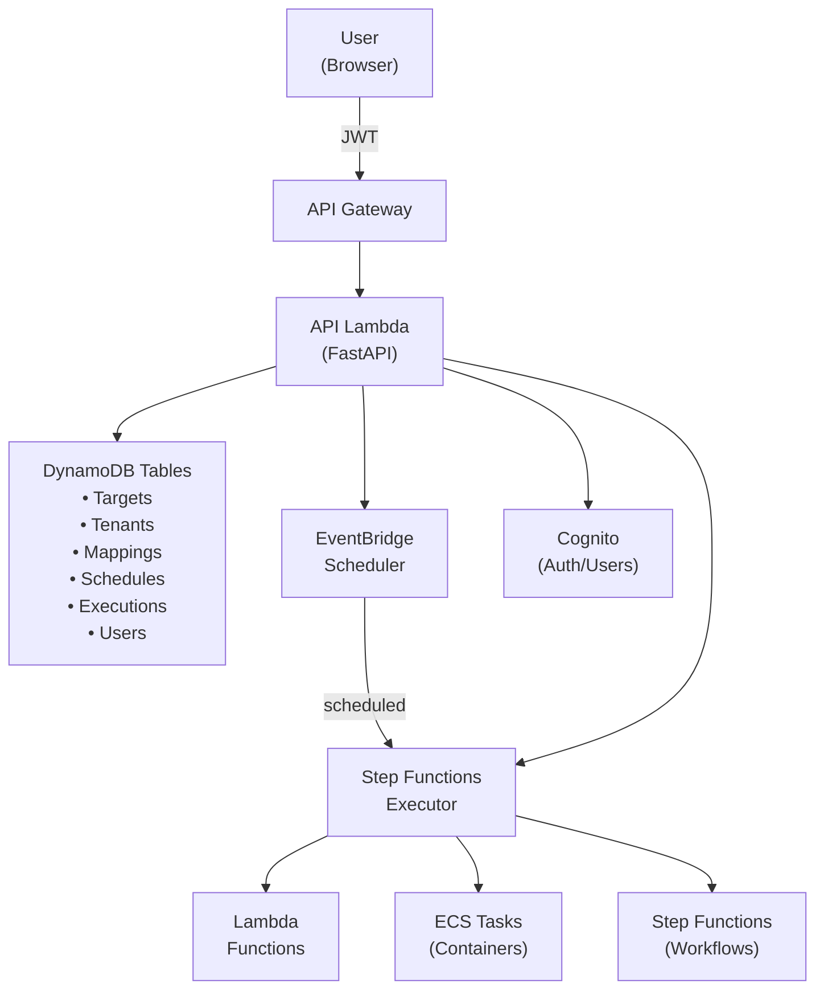

# Serverless Task Scheduler

A multi-tenant AWS serverless platform for scheduling and executing tasks across Lambda functions, ECS containers, and Step Functions workflows.

## What It Does

This service acts as a centralized scheduler for AWS services, similar to a cron server but designed for the cloud. It provides:

- **Task Scheduling** - Run AWS services on a schedule (like cron jobs)
- **On-Demand Execution** - Trigger services via REST API
- **Multi-Tenancy** - Isolate different organizations' resources
- **Access Control** - Role-based permissions using AWS Cognito
- **Execution History** - Track all task runs with detailed logs

**Think of it as:** A smart task scheduler for AWS that multiple teams can safely share.

## Core Concepts

### Targets
A **target** is an AWS service you want to execute. Three types are supported:
- **Lambda** - Functions for quick tasks (< 15 minutes)
- **ECS** - Containers for longer workloads
- **Step Functions** - Multi-step workflows

Each target includes an ARN (AWS Resource Name), configuration, and parameter schema.

### Tenants
A **tenant** represents an organization or team. Tenants are isolated - they can't see or access each other's resources.

### Tenant Mappings
A **mapping** gives a tenant a friendly alias for a target. This allows:
- Custom naming per tenant
- Different tenants using different versions
- Easy upgrades without breaking tenant code

**Example:** Both `acme-corp` and `globex-inc` can have an alias `send-email`, pointing to different Lambda versions.

### Schedules
A **schedule** automatically runs a mapping at specified times using AWS EventBridge Scheduler.

**Examples:**
- `rate(5 minutes)` - Every 5 minutes
- `cron(0 12 * * ? *)` - Daily at noon UTC
- `at(2024-12-31T23:59:59)` - One-time execution

## Architecture



### How Execution Works

**The Step Functions Executor** is a state machine that orchestrates all task execution:

1. **Triggered by:**
   - EventBridge Scheduler (for scheduled tasks)
   - API Lambda (for on-demand execution)

2. **Execution Flow:**
   1. Preprocessing Lambda resolves the tenant mapping and merges payload
   2. Executor state machine invokes the target service
   3. Helper Lambda captures CloudWatch logs (for Lambda targets)
   4. Postprocessing Lambda records results to DynamoDB

3. **Why Step Functions?**
   - **Reliable** - Automatic retries and error handling
   - **Observable** - Visual execution history in AWS Console
   - **Flexible** - Supports sync/async execution patterns
   - **Integrated** - Native support for Lambda, ECS, and nested Step Functions

### Security Model

Three IAM roles provide defense-in-depth:

1. **API Lambda Role**
   - Reads/writes DynamoDB
   - Manages EventBridge schedules
   - Starts Step Functions executions
   - ❌ Cannot invoke targets directly

2. **EventBridge Scheduler Role**
   - ✅ Can only start the Executor state machine
   - ❌ Cannot do anything else (least privilege)

3. **Executor State Machine Role**
   - Invokes Lambda/ECS/Step Functions
   - Reads/writes execution records
   - Accesses CloudWatch logs
   - ⚠️ Most privileged role - only used by executor

## Quick Start

### Prerequisites
- AWS Account with CLI configured
- AWS SAM CLI installed
- Python 3.13+
- Node.js 18+ (for UI)
- **Windows users:** WSL2 or Docker (required for building Python cryptography packages)

### Deploy

```bash
# Quick deploy (builds UI + deploys everything)
./quickdeploy.sh

# Or deploy manually:
sam build
sam deploy --guided
```

The deploy creates:
- API Gateway endpoint
- Lambda functions (API + execution helpers)
- Step Functions state machine
- DynamoDB tables (6 total)
- Cognito user pool
- EventBridge schedule groups

### First-Time Setup

After deployment, an initial admin user is automatically created in Cognito with the email from the `*:owner` tag.

1. **Log in to the web UI:**
   - Navigate to your API Gateway URL
   - Use the email address from the `*:owner` tag as your username
   - Complete the password reset process (first login requires password change)

2. **Start using the application:**
   - Create additional users via the Users page
   - Create tenants and grant users access
   - Define targets (Lambda, ECS, or Step Functions)
   - Create tenant mappings and schedules

## API Reference

For complete API documentation, interactive testing, and detailed request/response schemas, visit:

- **`/swagger`** - Swagger UI with live API testing
- **`/redoc`** - ReDoc documentation (alternative view)
- **`/openapi.json`** - OpenAPI 3.0 specification

### Authentication

All endpoints require a JWT token from Cognito (except `/health`, `/`, `/swagger`, `/redoc`, and `/openapi.json`):

```
Authorization: Bearer <your-jwt-token>
```

Get your JWT token by logging into the web UI at your API Gateway URL.

## Testing

### Bruno API Collection
The `api/bruno/` directory contains a complete API test suite.

1. Open in Bruno
2. Set `authToken` variable with your JWT
3. Update tenant IDs as needed
4. Run requests

### Local Development

**API (FastAPI):**
```bash
cd api
python -m venv venv
source venv/bin/activate  # Windows: venv\Scripts\activate
pip install -r requirements.txt
uvicorn app.main:app --reload --port 8080
```

**UI (React):**
```bash
cd ui-react
npm install
npm start
```

## Project Structure

```
serverless-task-scheduler/
├── api/                      # FastAPI REST API
│   ├── app/
│   │   ├── main.py          # FastAPI application
│   │   ├── lambda_handler.py # AWS Lambda entry point
│   │   ├── routers/         # API routes
│   │   ├── models/          # Pydantic models
│   │   ├── awssdk/          # AWS SDK wrappers
│   │   └── wwwroot/         # Static UI files (auto-generated)
│   └── requirements.txt     # Python dependencies
│
├── task-execution/          # Step Functions executor
│   ├── state_machine.json   # Step Functions definition (ASL)
│   ├── preprocessing.py     # Resolve targets & merge payloads
│   ├── lambda_execution_helper.py # Capture Lambda logs
│   ├── postprocessing.py    # Record execution results
│   └── requirements.txt
│
├── ui-react/                # React web interface
│   ├── src/
│   │   ├── App.js          # Main app component
│   │   ├── components/     # React components
│   │   └── config.js       # API configuration
│   └── package.json
│
└── template.yaml            # AWS SAM template
```

## Why These Technologies?

**DynamoDB** - Serverless, auto-scaling, fast key-value lookups

**EventBridge Scheduler** - Native AWS scheduler with cron/rate expressions and timezone support

**Step Functions** - Visual workflow orchestration with built-in retry logic and error handling

**FastAPI** - Modern Python web framework with automatic API docs and type validation

**React** - Popular UI framework with component-based architecture

## Contributing

### Requirements
- Python 3.13+
- Node.js 18+
- AWS SAM CLI
- Bruno (for API testing)

### Code Quality
All code has been linted and formatted:
- Python: flake8 compliant (except line length)
- JavaScript: ESLint + Prettier

### Recent Updates
- ✅ Updated all Python packages (including python-jose security fix)
- ✅ Updated all Node packages (React 19.2+)
- ✅ Fixed all linting warnings in Python and JavaScript
- ✅ Cleaned up unused imports and variables
- ✅ Directory structure reorganization (ExecutionAPI→api, ExecutorStepFunction→task-execution, ui→ui-react)

## License

[Add your license here]
